**The University of Melbourne**

# COMP30019 – Graphics and Interaction

<p>
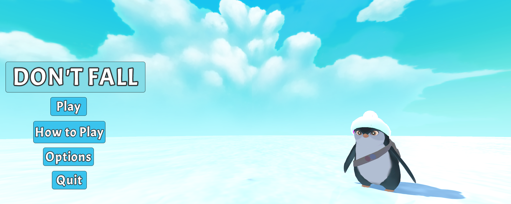
</P>
## Table of contents

TODO CHANGE CONTENTS STRUCTURE

- [COMP30019 – Graphics and Interaction](#comp30019--graphics-and-interaction)
  - [Table of contents](#table-of-contents)
  - [Team Members](#team-members)
  - [General info and explanation](#general-info-and-explanation)
    - [Storyline](#storyline)
    - [How to play](#how-to-play)
    - [Overall design](#overall-design)
    - [Cheating mode](#cheating-mode)
    - [Shader effect](#shader-effect)
    - [Evaluation and report](#evaluation-and-report)
  - [Game Mechanics](#game-mechanics)
    - [Player and Tower](#player-and-tower)
    - [Jumping](#jumping)
    - [Walking](#walking)
    - [Gravity](#gravity)
    - [Bouncing](#bouncing)
  - [Camera motion](#camera-motion)
  - [Custom Shaders](#custom-shaders)
    - [Snow Shader](#snow-shader)
    - [Skybox Shader](#skybox-shader)
  - [Graphics pipeline](#graphics-pipeline)
  - [Particle Systems](#particle-systems)
    - [Snow Environment](#snow-environment)
    - [Jump and Land Effects](#jump-and-land-effects)
  - [Sound](#sound)
  - [Animations](#animations)
  - [UI](#ui)
    - [Jump Power Bar](#jump-power-bar)
    - [Progress Bar](#progress-bar)
  - [Querying and observational method](#querying-and-observational-method)
  - [Changes and improvements according to the evaluation](#changes-and-improvements-according-to-the-evaluation)
    - [Difficulty](#difficulty)
    - [Motivation](#motivation)
    - [Bug fixes](#bug-fixes)
    - [Controls](#controls)
  - [Reference list](#reference-list)
  - [Technologies](#technologies)

## Team Members

| Name              |            Task            | State |
| :---------------- | :------------------------: | ----: |
| Kaif Ahsan        | Level Design & Development |  Done |
| Kaif Ahsan        | Menu Design & Development  |  Done |
| Kaif Ahsan        | Miscellaneous UI elements  |  Done |
| Kaif Ahsan        |        Cheat Script        |  Done |
| Khant Thurein Han |      Player Mechanics      |  Done |
| Khant Thurein Han |         Animations         |  Done |
| Khant Thurein Han |    Sound + AudioManager    |  Done |
| Khant Thurein Han |      Particle Effects      |  Done |
| Khant Thurein Han |    Progress & Power bar    |  Done |
| Khant Thurein Han |       Sign + Dialog        |  Done |
| Khant Thurein Han |          Shaders           |  Done |
| Hanyong Zhou      | Level Design & Development |  Done |
| Hanyong Zhou      |       Trailer/Video        |  Done |
| Hanyong Zhou      |  Intro + Ending Cutscenes  |  Done |
| Zenan Huang       |         Aniamtion          |  Done |
| Zenan Huang       |       Evaluatuation        |  Done |
| Zenan Huang       |           Report           |  Done |

## General info and explanation

Don't Fall is a promising strategy game full of physics and magic. The game is inspired by titles like Jump King and Getting Over It. The game intends to frustrate players by having simple mechanics yet hard level design, where the punishment of making a mistake is extremely severe, causing the player to lose progress and forces the player to redo parts of the level they have previously completed.

The player controls the penguin by the jumping and walking mechanics, and the target is to get to the top. It is not as simple as imagined, and full of tricks on the way up. The key is DON'T FALL.

### Storyline

One day in the snowfield, a penguin was wandering around, and he suddenly saw some birds flying in the sky. He was shocked by how beautiful and free the birds are, and decided to learn how to fly. He was an ambitious bird, and he was so jealous of the birds. He asked one bird to teach him how to fly, and the bird said " You just climb to the top of the mountain. Jump from the top, and flap your wings. Then you can fly". Therefore, the penguin decided to climb to the highest peak of the mountain, to jump off and fly.

### How to play

The menu includes "Play" button for starting the game, "Option" button for adjusting the volume, and "Quit" button for quitting the game. Once the player pressed "Play", a trailer of the storyline video will be played, and the space key can be used to skip the video.

A small tutorial will be shown about the play mechanism. The penguin will implement two mechanisms: jumping and walking. For jumping, the **space key** should be pressed and held, and the **left and right keys** should control the direction. The higher the player get, the narrower the stones will be, so that the level of difficulties increases. The player can also walk left or right by pressing left and right keys, to adjust the start-jumping position.

There is a power bar indicating the power, so as the height of jumping on the left bottom corner. The longer the power bar is, the higher the penguin will jump. Also, there is a position bar indicating the height the penguin has climbed, and it changes according to the penguin's position in relation to the cylinder.

**Key Bindings**
| Key | Action |
| :---------------- | :------------------------: |
| Space Bar | Jump |
| Right arrow | Move right |
| Left arrow | Move Left |
| Left Shift | Holding Activates cheat mode |

### Overall design

The overall design is a snow scene with a cylinder in the middle representing the mountain, and there are many stones with different shapes on it for the penguin to step on. The difficulty of the game increases with the height, that the higher the penguin gets, the narrower and smaller the stones will be, and more techniques will be required to jump higher. The environment is a snowfield with snow flakes in the air. The background music is cheerful and relaxing with sound effects when the penguin jumps and falls.

### Cheating mode

A cheating mode is implemented for the convenience of testing, which the player can press and hold the left shift key, and use the direction keys to move the penguin freely in all directions.

### Shader effect

The skyline shader and snow effect were used to create a more realistic and fantastic environment, and will be further explained in details.

### Evaluation and report

Post-task walkthroughs and interview were used as the querying technique and observational method for the evaluation, and improvements have been made.

## Game Mechanics

The player is able to jump up the tower. While midair, the player is unable to control the direction it is moving in. Thus, players have to plan how and where to jump.

The player is also able to walk while on ground.

There are two key objects: the player and the tower/cylinder. We wanted an effect as if the player is going around the tower.

### Player and Tower

The player is fixed on the X and Z axis and only modify the Y axis based on the elevation.

The tower is fixed in world space, with all rotational axises also fixed except for the Y axis. To simulate the horizontal everytime the player moves, we rotate the tower by using the AddTorque() method from the Tower's rigidbody, which gives the optical illusion as if the player is moving around the tower.

The tower is set to a very high mass to prevent objects from rotating the tower.

### Jumping

When the player jumps, a Y velocity is added onto the Player's rigidbody component, which launches the player into the air. To prevent the player from jumping mid air, we need to have a ground check. This is done by using the Physics.BoxCast() function which checks for the ground underneath the player.

```c#
void Jump(){
  ...
  rb.velocity += Vector3.up * jumpPower;
  if (Input.GetAxis("Horizontal") != 0f && Mathf.Sign(Input.GetAxis("Horizontal")) == Mathf.Sign(direction)){
    trb.AddTorque(Vector3.up * direction * angularSpeed, ForceMode.VelocityChange);
  }
  ...
}
```

### Walking

When the ground check is active, the player is allow to walk either left or right. A fixed angular speed for the tower is set once a directional button is pressed. Else, the angular speed is set to 0 to stop the player from sliding.

### Gravity

A typical jump follows a normal parabola which is accurate in real life but feels sluggish in games. To fix this issue, the player also has gravity script, which changes the Player's falling speed to make jumping easier and more accurate for players, as well as to improve the feeling of jumping.

### Bouncing

The player also has a BounceHorizontal object which makes the players bounce off walls throughtout the game. The usual method of applying a Physics Material does not work in this case as due to the rotational physics we have for the tower. Thus, BounceHorizontal has a Trigger Box Collider, which reverses the tower's angular velocity if the collider comes into contact with a platform.

## Camera motion

For the camera, we chose a third person view as the game is a third-person platformer. The camera system follows the "world in hand" approach as the camera's navigation is reliant on the player's position in the environment. This is done by simply attaching the main camera to the player object, which results in the camera following the player around.

## Custom Shaders

Two custom shaders were written for the project, one for the terrain and one for the skybox.

### Snow Shader

The majority of the terrain in the game uses the snow shader. The shader is a custom multipass shader where a phong shading model is first applied.

The Phong Shader consists of three parts: Ambient, Diffuse and Specular. As a snow does reflect some light, we set the speculation constant to 1, and the shininess constant to 1, which gave us the effect we wanted.

```c#
fixed4 frag(vertOut i) : COLOR {
  ...
  // Ambient component
  float3 ambientLighting = UNITY_LIGHTMODEL_AMBIENT.rgb * _Colour.rgb;
  // Diffuse component
  float3 diffuseReflection = _LightColor0.rgb * _Colour.rgb *
  max(0.0, dot(normalDirection, lightDirection)) * attenuation;

  float3 H = normalize(viewDirection + lightDirection);
  // Speculation component
  float specConstant = 1f;
  float3 spec = attenuation * _LightColor0  * specConstant * pow(saturate(dot(normalDirection, H)), _SpecN);

  // Calculating colour based on the three components
  float3 color = (ambientLighting + diffuseReflection + spec) * tex2D(_Tex, i.uv);
  ...
}

```

The second part is a surface shader that applies multiple maps onto the objects.

The maps are:

- Normal (Bump) map is used to make the texture look like it has bumps.
- Height map is used to modify the underlying mesh.
- Occlusion map is used to improve shadow detail.
- Texture for the standard 2D texture to be applied.

The second part also adds an emission color to the snow to create a cartoony blue snow effect.

<p align="center">
  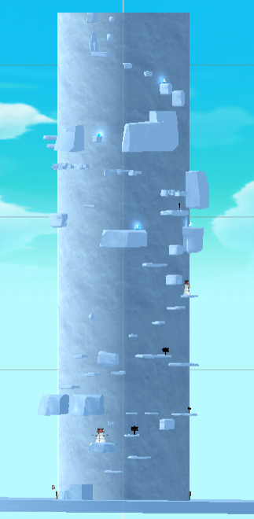
</p>

### Skybox Shader

A custom skybox shader was created for the skybox transitions during the game. The shader was written to accept 3 Skybox cube textures, with a blend attribute which controls the blend between the skyboxes. A C# script is then used to modify the value of the blend depending on how far the player has progressed.

The blend is a range from 0 - 2. A blend value between 0 and 1 will blend skybox0 and skybox1 together, whereas a value between 1 and will blend skybox1 and skybox2 together. If the blend values are whole numbers (0,1,2), they correspond to the skyboxes without any blend effects.

```c#
fixed4 frag (v2f i) : SV_Target
{
    half4 tex1 = texCUBE (_Tex1, i.texcoord);
    half4 tex2 = texCUBE (_Tex2, i.texcoord);
    half4 tex3 = texCUBE (_Tex3, i.texcoord);
    half3 c1 = DecodeHDR (tex1, _Tex1_HDR);
    half3 c2 = DecodeHDR (tex2, _Tex2_HDR);
    half3 c3 = DecodeHDR (tex3, _Tex3_HDR);

    half3 c = half3(0, 0, 0);
    if (_Blend >= 0 && _Blend < 1) {
        c = lerp(c1, c2, smoothstep(0,1,_Blend));
    }
    else {
        c = lerp(c2, c3, smoothstep(0,1,_Blend - 1));
    }

    c = c * _Tint.rgb * unity_ColorSpaceDouble.rgb;
    c *= _Exposure;
    return half4(c, 1);
}
```

<p align="center">
  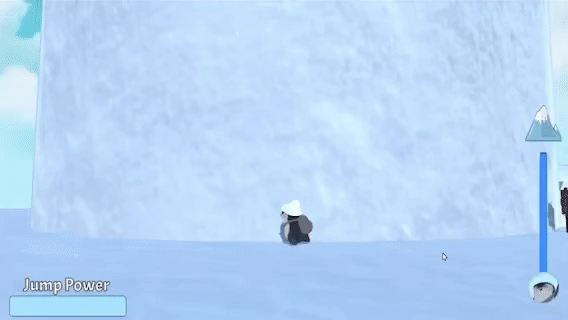
</p>

## Graphics pipeline

For the SnowShader, since we used a multipass shader, after applying Phong shading at the pixel shader stage, we repeat the pixel shader stage again for the surface shader effects.

## Particle Systems

Two particle systems were used for the game. One is used to simulate falling snow, the other is used to simulate environmental response to player movement (Jumping and Landing).

### Snow Environment

This particle system simulates snow slowly falling. To do this, we first set the shape of the particle system to a box. The particles were given a random X velocity between 2 values for randomness, with a negative Y value to make the snow fall.

Multiple prefab instances of the particle systems are then placed throughout the tower as a child of the tower. This makes the snow rotate together with the tower in local space.

<p align="center">
  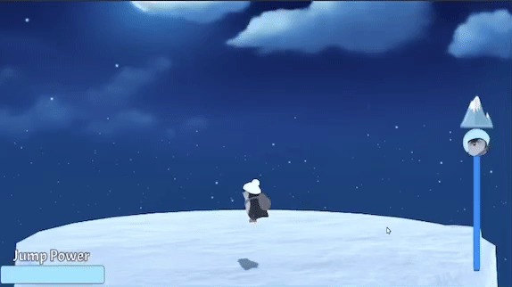
</p>

### Jump and Land Effects

This particle system simulates the movement of snow particles when a player jumps or lands. To do this, a prefab of a particle system was created where the particles were given a high initial positive Y velocity and then transitions to a negative Y velocity over time. The X velocity is generated randomly over a range to make it look realistic.

When a player jumps, a prefab of this particle system is generated at the postion when the player leaves the ground. After a few seconds, this is destroyed. This system is attached as child of tower, so that it rotates according to the tower movement as well.

<p align="center">
  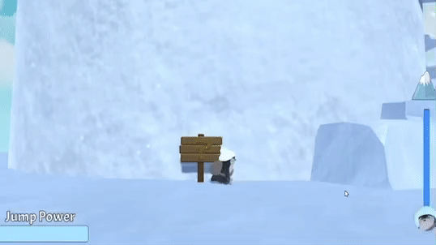
</p>

## Sound

The AudioManager manages all the sound that is present in the game. This is done with a custom Sound class which are stored as an array in the AudioManager. The AudioManager is then able to play specific sounds given a string name that corresponds to the name that the sound was initialized with.

## Animations

The animation comes with the asset that we imported for the Player. A custom Animator was created to fit the needs of our PlayerController class, which updates corresponding values of the Animator depending on what the player does.

## UI

### Jump Power Bar

This UI element shows the amount of power in the player's jump when the jump button is released. To do this, a custom Powerbar class is created, whose values can be updated externally by the PlayerController class to reflect the jumpPower value. The bar moves up and down to give more flexibility to the player.

<p align="center">
  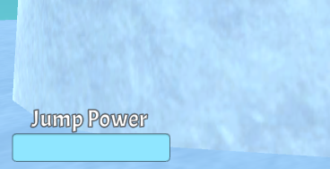
</p>

### Progress Bar

This element shows the player's progress of the level. The same Powerbar used for Jumping is used here as well. This is done by constantly updating the ratio calculated from the tower's highest Y point and the player's current Y position.

<p align="center">
  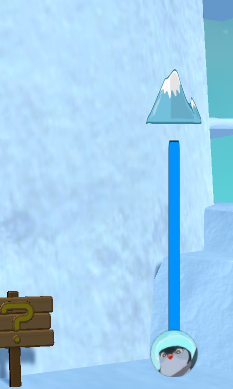
</p>

## Querying and observational method

Post-task walkthroughs and interview were used as the querying technique and observational methods. Considering our game is an intensive game, and involves a lot of focus, it is not likely to interrupt the players as they are playing the game. Also, the process and mechanisms are not too complicated, so the chances of their forgetting their previous actions are small. Rather than questionnaire, we used the interview method, because most of our questions are open, and require their personal ideas and unbounded thoughts. With the face-to-face interview and the voice recording with their consents, more details can be recorded, and we identified some problems or concerns we did not notice by ourselves.

10 participants, aged from 19 to 21, with balanced gender division, who are peers of our group members, were invited to complete our evaluation interview.

Participants were asked to watch the trailer at the beginning of the game to get familiar to the storyline, and play the game by themselves. After fifteen minutes if they have not finished the game by themselves, the cheating mode was introduced to them. After they finished the game, eleven questions, regarding to the overall impression and feeling (e.g. Is there anything you want to say right after you played this game? What kind of game do you think it is?), design (How do you like the overall visual/sound effects? Will you associate the actions with the outcome you expect to achieve?), improvements (Where do you think we can improve our game? Is there any bugs that you noticed?), and evaluation (How likely would you recommend this game to your friends, rating from 1 to 10?, How much are you willing to pay for this game if it is in the game store?), were asked, and voice recordings were applied.

Then the results were collected and analyzed by our team members. For the overall feelings, half of the participants were satisfying, and the other half of them said it was frustrating and too difficult and intensive. 8 of them claimed that the storyline was clear and makes sense, with the other 2 unavailable answers, because they skipped the trailer. For the visual effects, 6 participants said they were cute, good, and not chaotic, and 4 of them suggested more variation and decorations. For the sound effects, half of them were satisfied with that, and the other half felt annoyed by the sound because of lack of diversity, and suggested more variations and the volume control button, which we have not implemented it yet for our test game by that time.

There are mainly four suggested improvements from the participants. First of all, checkpoints were required to indicate the height the penguin have reached so far, to give motivations to the players to jump higher to the top. Second, there were some bugs occurred on the colliders, that sometimes the penguin cannot land properly on the stones, which we have not fixed all of them for our test version of the game. Third, we need more variations for our design. For example, more colors can be used to indicate the height of the cylinder. Also, more decorations should be used to add more fun, and more sounds should be added so that the player will no longer likely to get bored. Finally, the button control mechanism should be improved, because it takes time to get used to it.

For the evaluation, the rating from 1 (highly dislike) to 10 (highly like) was used. 2 of the participants rated less than 5, 3 rated 5, and 5 rated more than 5, with the average answer to be 5.6. When asked how much they are willing to pay for the game, 5 said $0, 3 said $0.01-$3, and 2 said more than $3, with the average answer to be \$2.22.

## Changes and improvements according to the evaluation

Regarding to the feedbacks and suggested improvement from the participants, changes in five aspects were made.

//// I think im too cooked to write this properly im sorry. I'm just dumping what I write here first - Tony

### Difficulty

As mentioned in our summary of the data, a large number of participants felt that the game was too difficult. Upon observing their gameplay, they found difficulties even within the earliest stages of the game. This suggested that we needed an easier start to the game followed by a gradual increase in difficulty, allowing us to ease players into the game.The reason the early stages were difficult was due to the platforms being too narrow, making it easier for players to overshoot and miss. Due to this, we counteracted by widening the platforms with an example shown below.

| Before                                                     |                          After                           |
| :--------------------------------------------------------- | :------------------------------------------------------: |
| 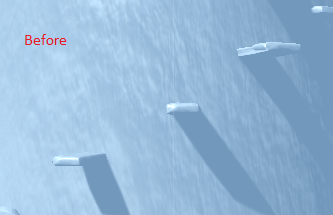 | 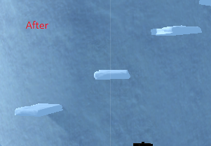 |

Furthermore, the lack of instructions in our evaluation also added to the frustration and difficulty. Due to this, signs were added that hinted to possible tricks and instructions.

<p align="center">
  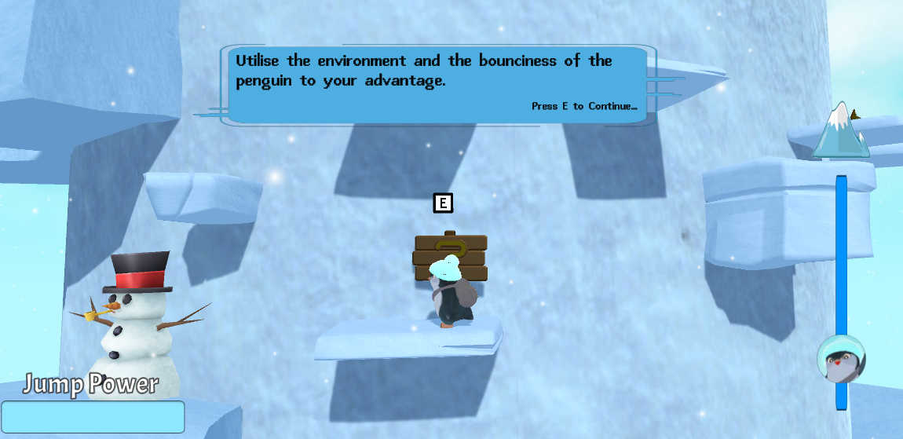
</p>

### Motivation

From the suggested improvements, we suspected that the low motivation to play was due to a plain and over consistent visual as well as not being able to gage their progress.

We improved upon the aesthetics through the addition of props and decorations scattered throughout the map. These props and decorations are also chosen in a way that serves as an indication of progress. What started off with a few friendly snowmen changes to skulls and mysterious crystals as the player climbs. With the help of reduced lighting for ambience, this helps to indicate to the player that they are slowly stepping into more and more dangerous territory with higher stake jumps whilst appealing to people's natural exploratory instincts.

<p align="center">
  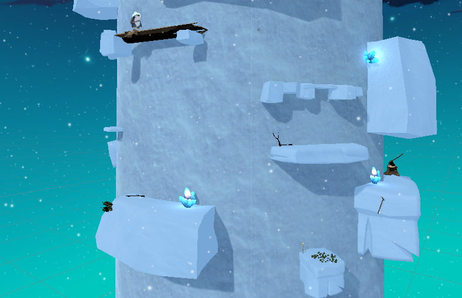
</p>

Furthermore, a progress bar was introduced so that players can see how far away from the goal they were.

<p align="center">
  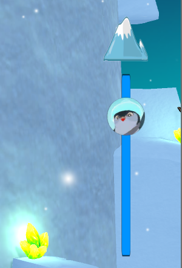
</p>

### Bug fixes

The various bugs that were made aware to us have also been fixed. In particular, incorrect interactions with colliders.

### Controls

/// INSERT CONTROL CHANGES INCLUDING JUMP BUFFER AND HOW THE POWER BAR GOES UP AND DOWN.

First of all, we decrease the level of difficulty of this game by enlarging the size of the stones, and made the difficulties increase more gradually by the height.

Second, checkpoints and the position bar were added to show the current height the penguin is at, so that the player will know their progress and have more motivation to finish the game.

Third, the collider problems have been fixed. Weird landing position or missing colliders have been avoided.

Fourth, we added more decorations, such as the crystals and signs. The color is changing with the height now, from the light blue at the bottom and dark blue on the top. The volume control button was implemented, and the players can adjust the volume by themselves. More sound effects, such as the falling sound, was added.

Fifth, the issue with unintuitive button controls have been fixed by adding signs to instruct the users. Also, a slight time buffer was added to account for the case where the user releases both the jump and directional buffer at the same time. The old implementation forces the directional button to be held down due to Input.GetAxis("Horizontal") needing to be either 1 or -1 for directional jumps. This is done by lowering the input sensitivity from the Input Manager and using the Mathf.Sign(Input.GetAxis("Horizontal")) to accept all values greater or less than 0.

## Reference list

#### Player

- Penguin: https://assetstore.unity.com/packages/templates/tutorials/dyp-the-penguin-174519

#### Mountain

- Bars: https://assetstore.unity.com/packages/tools/gui/simple-healthbars-132547
- Bones and Pickaxe: https://assetstore.unity.com/packages/3d/environments/fantasy/stones-and-buried-treasure-95557
- Picks, shovels, axe: https://assetstore.unity.com/packages/3d/props/tools/tool-starter-kit-63102
- Logs, grass: https://assetstore.unity.com/packages/3d/environments/low-poly-free-vegetation-pack-176906
- Birds: https://assetstore.unity.com/packages/3d/characters/animals/birds/living-birds-15649
- Skybox: https://assetstore.unity.com/packages/2d/textures-materials/sky/fantasy-skybox-free-18353
- Crystals: https://assetstore.unity.com/packages/3d/environments/fantasy/translucent-crystals-106274
- Platform Rocks: https://assetstore.unity.com/packages/3d/free-hand-painted-rocks-n-boulders-80634
- Platform Rocks: https://assetstore.unity.com/packages/3d/environments/landscapes/vert-vaults-rocks-pack-lite-178085
- Flag: https://assetstore.unity.com/packages/3d/props/exterior/cloth-animation-based-flag-65842
- Skeleton: https://overactiongames.itch.io/animated-cartoon-low-poly-skeleton
- Snowman: https://assetstore.unity.com/packages/3d/props/cute-snowman-12477

#### UI

- Dialog box: https://pngtree.com/

#### Music

- SFX: https://www.zapsplat.com/
- Main Theme: https://www.youtube.com/watch?v=3o8008aFFUI
- Audio Manager: https://youtu.be/6OT43pvUyfY
- Video Playback: https://www.youtube.com/watch?v=p7iXEZGx2Mc

## Technologies

Project is created with:

- Unity 2019.4.3f1
